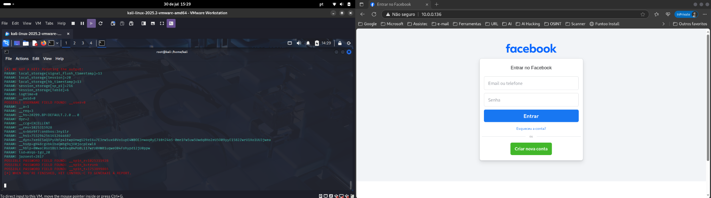
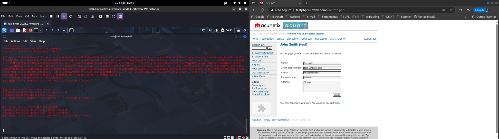
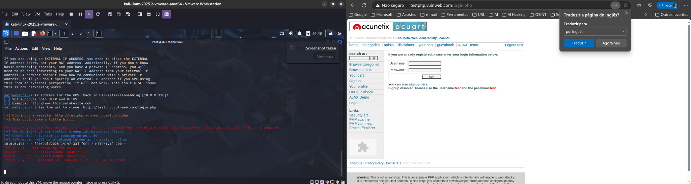
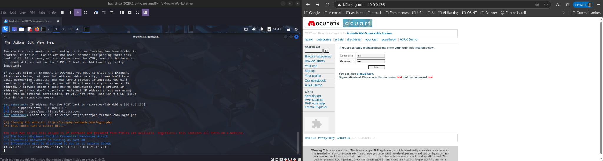

# Desafio de Cybersecurity: Phishing com SEToolkit

Este repositório documenta a execução de um ataque de engenharia social utilizando a ferramenta **SEToolkit** (Social-Engineer Toolkit), com o objetivo educacional de simular um ataque de coleta de credenciais através de uma página clonada. Este projeto foi desenvolvido em ambiente controlado como parte do desafio da [DIO](https://www.dio.me).

## ⚠️ Aviso Legal

> Este projeto é exclusivamente educacional e foi executado em ambiente controlado com fins de aprendizado. Não utilize esta técnica para fins maliciosos, ilegais ou contra a vontade de terceiros.

---

## 🧠 Objetivo

Utilizar a funcionalidade *Credential Harvester* do SET para clonar um site com formulário de login, hospedar em rede local e capturar dados de entrada do usuário.

---

## 🎯 Ferramenta Utilizada

- **Kali Linux 2025.2** (VM)
- **SEToolkit**: Ferramenta de código aberto para testes de engenharia social.

---

## 📷 Demonstrações

### 1. Tentativa de clonar o Facebook (sem sucesso)
O Facebook, assim como outros serviços modernos como Gmail e Outlook, utiliza mecanismos de segurança como:

- Proteção contra *clickjacking*
- CSP (Content Security Policy)
- SameSite Cookies
- HSTS
- Tokens CSRF
- Detecção de clonagem de DOM

Por conta disso, a clonagem da página de login do Facebook com o SEToolkit resultou em falha na captura de credenciais:



---

### 2. Clonagem do site vulnerável testphp.vulnweb.com

Inicialmente, a página de edição de perfil (`/userinfo.php`) também falhou na captura de dados:


Em seguida, utilizamos a página `/login.php`, que funcionou com sucesso e permitiu a coleta de credenciais.



---

### 3. Captura de Credenciais com Sucesso

Ao inserir os dados no formulário clonado, a ferramenta SEToolkit capturou corretamente os campos `username` e `password` como demonstrado abaixo:




---

## 🛠️ Comandos Executados

```bash
sudo setoolkit
```

- **1)** Social-Engineering Attacks
- **2)** Website Attack Vectors
- **3)** Credential Harvester Attack Method
- **2)** Site Cloner
- Target URL: `http://testphp.vulnweb.com/login.php`
- Hosting IP: `10.0.0.136` (IP local da máquina com Kali Linux)

---

## 💡 Considerações Finais

- Sites modernos como Facebook, Gmail e Outlook possuem mecanismos avançados de segurança que impedem ataques via clonado de forma direta com ferramentas básicas.
- Para testes, utilize sempre ambientes vulneráveis como o `vulnweb.com` ou crie páginas simples em servidores locais.
- Documentar esses experimentos fortalece sua capacidade de raciocínio técnico e ajuda na construção de um portfólio sólido.

---

## 📁 Estrutura do Projeto

```
.
├── .gitignore
├── README.md
└── images
    ├── 1-facebook-clone-sem-captura.png
    ├── 2-testphp-info-falhou.png
    ├── 3-testphp-login-sucesso.png
    ├── 4-captura-sucesso-1.png
    └── 5-captura-sucesso-2.png
```

---

## ✍️ Autor

**Samuel Alves Pereira**  
- 💼 Linkedin:(https://www.linkedin.com/in/samuel-alves-pereira)  
- 🔗 GitHub: [https://github.com/brasill]

---

## 📎 Referências

- https://github.com/cassiano-dio/cibersecurity-desafio-phishing
- https://www.offensive-security.com/metasploit-unleashed/social-engineer-toolkit/
- https://github.com/trustedsec/social-engineer-toolkit
- https://testphp.vulnweb.com/
- https://www.markdownguide.org/basic-syntax/
- https://owasp.org/www-community/attacks/Phishing
